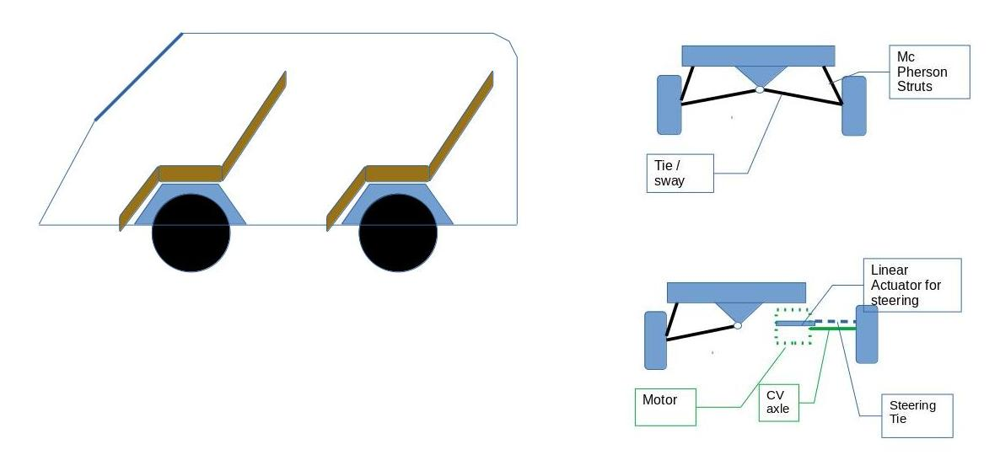

# OpenHUDware.car (alpha 0.2)

This open source design outlines a DIY electric vehicle. The design is loosely based on quad coptor drones with 4 independent motors removing the need for a traditional drivetrain. The control system is also electronic as in drones, removing the need for a mechanical steering column. 



The design is intended as a platform to run OpenHUD software, using an LCD screen as a replacement for the traditional windscreen (basically because I’ve wanted cars to have HUDs since I was a kid). Realistically these are two completely seperate projects; you could put an LCD w/OpenHUD on any old car, or have a DIY electric car without it. 


Ardupilot-rover open source software is used as the backbone of the control system (It has come to my attention that Ardupilot does not meet Standards and Guidlines for Safety Critical Software. As such I intend to write a basic control interface in Rust which ALSO won't be compliant, but at least I'll learn rust :-) non-critical systems could still be written in c++ or python). Additional work could be done to integrate google maps navigation with something like missionplanner or QgroundStation to make the car follow a predefined route. OpenHUD has object detection capabilities, but the neural networks used in OpenHUD would need additional training before full self-driving capabilities could be used. 


Don't drive this thing on public roads. I'm looking at getting this approved under the Street Rod certification program once completed. 


## Control System

* 4xESP32CAM 
* 4x 5MP OV5642 MINI CAM 
* ESP32-S3-WROOM-1-N8 DEV BRD @ AU$22.31
* MPU-9250 GY-9250 9-axis gyro AU $11.79
* NUCLEO-144 STM32F767 DEV EVAL BD AU$36.39 
* GPS MODULE W/ ANTENNA (NEO-M8N) AU$54.88

    
## Design Power
As a basis for comparison the Mini Cooper S has a power to weight ratio of 100W/kg. The least powerful Tesla has a motor power of around 200kw. Assuming around half of this power for a first time build
```
100kW (4x25kW motors) = 1000kg @ 100W/kg (e.g. 100W/kg)

1000kg/4 wheels = 250kg
r=0.241m
T= F * d
35 = m*a*d 		(motor torque is 35Nm per motor see below)
35 =250*0.241*a
a=0.58m/s/s

v=ut+0.5at^2
60(/3.6)=0+0.5*0.5*t^2
t=8.12
0-60km/h in approx 8.5 seconds

```
## Design weights and cost


## STEERING, DRIVE AND SUSPENSION

Independant suspension at each wheel. A linear actuator is used at each wheel to push/pull the wheel around its vertical axis in order to steer. This allows each wheel to steer independantly. A Motor is attached to each wheel, connected by a CV axle. This allows each wheel to spin independantly without requiring a diff, and also allows wheels to spin in opposite directions, allowing a turning circle of zero.


## Motors
```
MOTOR: MP-120100
MAX VOLT: 100V
MAX POWER: 22000W-25000W
MAX DRAW: 220-250A
ESC: ~250A
Rated power:12kw
Sustained draw: 120A @ 100V

SIZE: 120 x 120 ( without shaft )
Stator: 60mm
WEIGHT (g): 3.935
SHAFT: 12mm
MAX TORQUE: 35Nm (tesla roadster produces maximum torque of 270 N⋅m, Almost double the torque per wheel, which makes sense – it also has double the total power at around 50kw/wheel, and twice the acceleration...)
```
https://www.alibaba.com/product-detail/40hp-25KW-Outrunner-Electric-Motorcycle-Paraglider_60468056520.html?spm=a2700.wholesale.0.0.190e61e8YvrVye

## Battery 
```
Nissan leaf has 40kwh @350V =150Ah
Tesla Roadster 53kWh = 320km
Roadster uses 13.5 kWh/100km
Battery Capacity of 13.5-15kW should provide about 100km range.
15kWh/100V (motor voltage - above)= 150Ah 
This requires 7 of the following batteries in series.
```
https://www.alibaba.com/product-detail/CATL-4S1P-14-8V-150Ah-NMC_1600543065321.html?spm=a2700.galleryofferlist.normal_offer.d_title.1d8459b2kz6k64


## SEATS
https://www.alibaba.com/product-detail/Black-Fiber-Glass-for-Universal-Automobile_60786999946.html?spm=a2700.galleryofferlist.0.0.13a816fckn73oM

## Linear Actuators
```
Model-FD1
Input voltage- 12V/24V/110V DC
Load capacity- Max 6000N (push) / 4000N (pull)
Speed- 4 ~ 40mm/s (no load)
Stroke - 26mm ~ 1000mm (Customized Stroke Available)
Duty cycle -10%
Limit switches - Built-in, factory preset
Operation temperature - -20°C~ +40°C
Noise decibel - ≤48 dB
Protection class - IP44
Minimum installation distance - ≥stroke+160mm
```
https://www.alibaba.com/product-detail/12V-24V-electric-linear-actuator_317110836.html?spm=a2700.galleryofferlist.topad_classic.d_title.148f1ba8zJ4gv2


## CV Axles 
https://www.alibaba.com/product-detail/EPX-Front-left-Axle-Driving-Shaft_1600380300483.html?spm=a2700.wholesale.0.0.f2636e101nnIAB


## Frame & Materials (TO BE REDESIGNED)
Base = 2m x 3m

Roof = 2m x 3m

Sides = 3m x 1.5m

Ends = 1.5m x 2m

(20 x 20 x 1.6mm) Galvanised Square Hollow Section

See Spreadsheet.    
      

